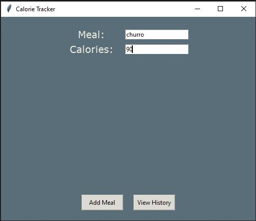
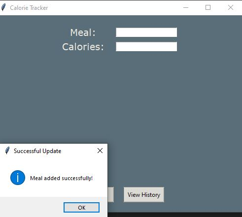
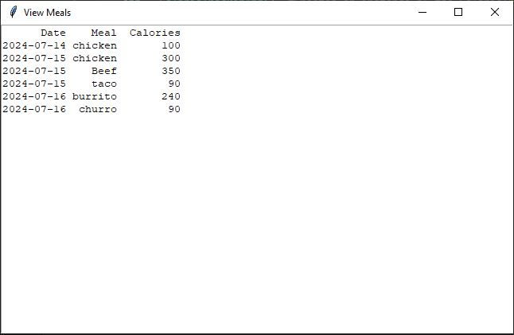

## Python-based calorie tracking program utilizing pandas for storing data along with Tkinter for functional UI allowing for users to input a meal they've eaten, and the amount of calories which is sorted into a CSV file for storage.

### Program upon start up:

### Successful addition of meal and calories:

### View of DataFrame including previous entry history:

